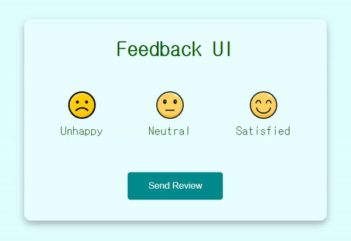

# Feedback-UI


## 기능  
피드백을 보낼 수 있는 UI 

## 학습 
### 1. HTML : small 태그  
덧붙이는 글이나, 저작권과 법률 표기 등의 작은 텍스트를 나타냅니다 

```
<p>
  This is the first sentence.
  <small>This whole sentence is in small letters.</small>
</p>
```

### 2. CSS : width와 max-width  
__width__  
- 100%로 설정할 경우, 요소의 크기를 감싸고 있는 요소의 크기에 맞춰 100% 유지  
- 창의 크기를 줄이거나 늘리면 창의 너비에 맞춰 크기가 충실히 증감


__max-width__  
- 100%로 설정할 경우, 요소의 기본 크기 이상으로 조절되지 않음
-  창의 크기를 줄이면 줄인만큼 충실히 줄어들지만,  크기를 키울 때는 원래 이미지 사이즈보다 커지지는 않는다.

## 학습 출처  
**아이콘**  
https://www.flaticon.com/  

**유튜브**  
https://www.youtube.com/@JavaScriptKing   

**HTML**  
https://developer.mozilla.org/ko/docs/Web/HTML/Element/small

**CSS**  
https://ccuram.tistory.com/29  

**키워드**  
- small 태그  
- width 와 max-width  
